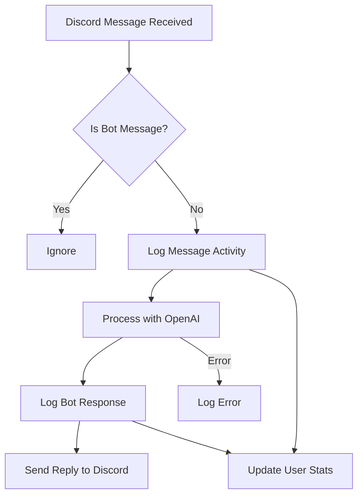

# Logging and Analytics Improvement Plan

## Overview

This plan outlines the steps to add logging and analytics features to the Discord OpenAI Chat Bot. The goal is to track usage, errors, and user statistics using file-based logging, provide analytics commands, and include privacy controls.

---

## 1. Logging and Analytics Requirements

### Message Activity Logging
- Log each message received (timestamp, user, channel, content summary)
- Log each bot response (timestamp, channel, content summary)

### Error Logging
- Log all exceptions and failed API calls with context

### User Statistics
- Track number of messages per user
- Track number of bot responses per user/channel
- Optionally, track command usage if commands are added later

### Analytics Presentation
- Add commands for admins to view stats (e.g., !stats, !topusers)
- Optionally, generate periodic reports (weekly/monthly summaries)

---

## 2. Logging/Analytics Storage

- **File-based logs**:
  - `logs/activity.log` (message activity)
  - `logs/errors.log` (errors and exceptions)
  - `logs/stats.json` (user and channel stats)
- Structure logs for easy parsing (JSON lines or CSV)

---

## 3. Implementation Steps

### Phase 1: Basic Logging
- Add file-based logging for all message activity and errors
- Structure logs for easy parsing (JSON lines or CSV)

### Phase 2: User Stats Tracking
- Maintain in-memory stats (per user, per channel)
- Periodically write stats to disk (e.g., `stats.json`)
- Add commands to display stats (e.g., !stats, !topusers)

### Phase 3: Advanced Analytics (Optional)
- Add more detailed analytics (e.g., message trends, active hours)
- Optionally, generate periodic reports

### Phase 4: Privacy & Data Retention
- Add config for log retention period
- Allow admins to clear logs/stats

---

## 4. Logging Flow Diagram



---

## 5. Example File Structure

```
logs/
  activity.log
  errors.log
  stats.json
```

---

## 6. Example Analytics Commands

- `!stats` — Show stats for the current user or channel
- `!topusers` — List most active users
- `!errors` — Show recent errors (admin only)

---

## 7. Privacy & Data Retention

- Configurable log retention period
- Admin commands to clear logs and stats

---

## 8. Future Enhancements

- Migrate to SQLite or another database for advanced analytics
- Add a web dashboard for visualization
- Integrate with external analytics or error tracking services